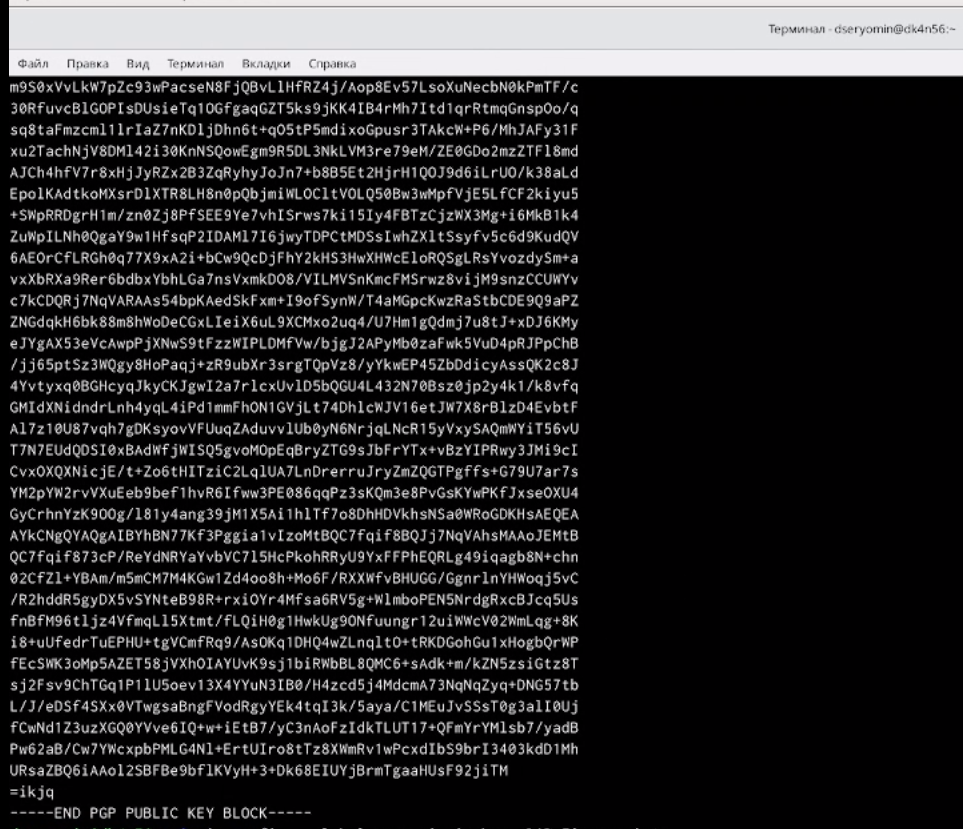
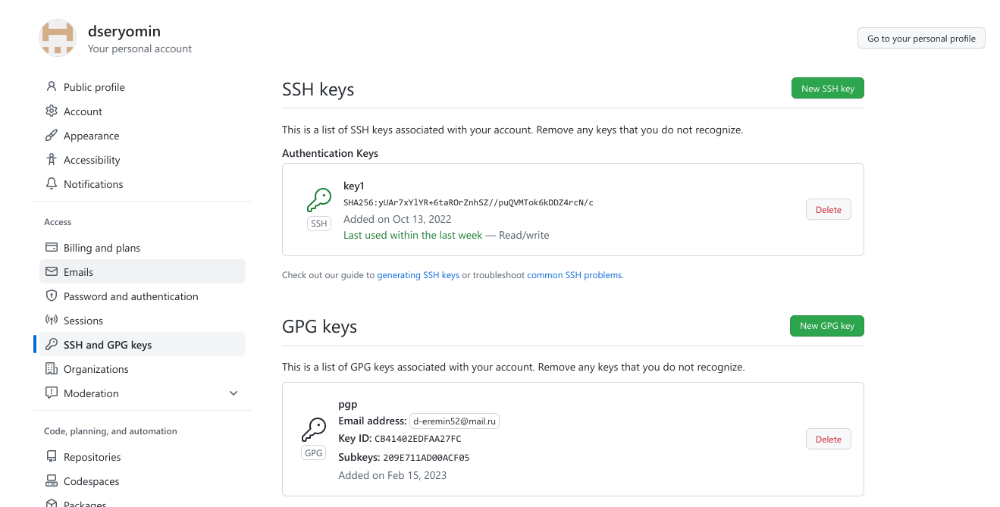
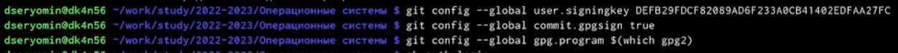
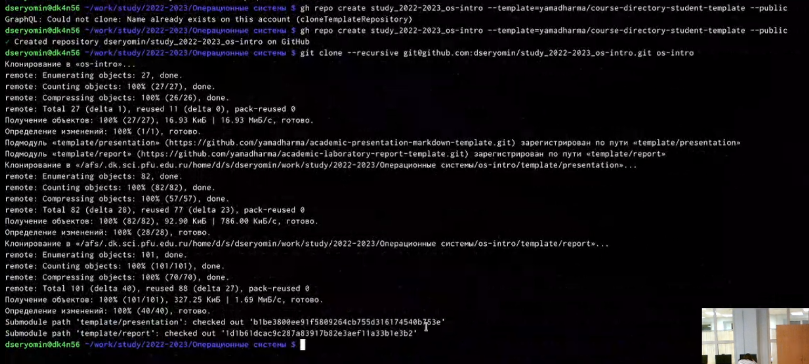
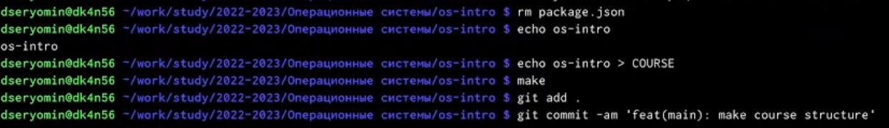
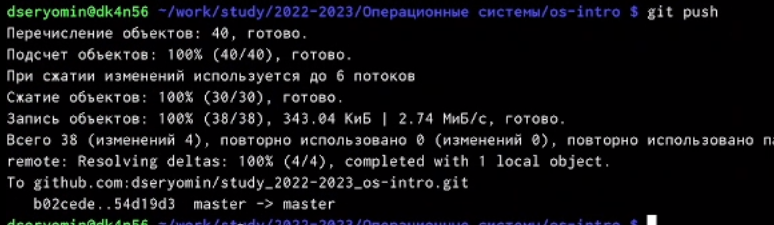

---
## Front matter
lang: ru-RU
title: Лабораторная работа 1
subtitle: Настройка git
author:
  - Ерёмин Д.С.
institute:
  - Российский университет дружбы народов, Москва, Россия
date: 15 февраля 2023

## i18n babel
babel-lang: russian
babel-otherlangs: english

## Formatting pdf
toc: false
toc-title: Содержание
slide_level: 2
aspectratio: 169
section-titles: true
theme: metropolis
header-includes:
 - \metroset{progressbar=frametitle,sectionpage=progressbar,numbering=fraction}
 - '\makeatletter'
 - '\beamer@ignorenonframefalse'
 - '\makeatother'
---

## Цели и задачи

Целью моей работы является настройка github

# Создание презентации

{ #fig:001 width=90% }

##  ключи на гитхаб

{ #fig:002 width=90% }

## набор команд для настройки автоматических подписей коммитов гит

{ #fig:003 width=90% }

## создание репозитория

{ #fig:004 width=90% }

## настройка репозитория

{ #fig:005 width=90% }

## отправка файлов на гитхаб

{ #fig:006 width=90% }


## Код для формата `pdf`

```yaml
slide_level: 2
aspectratio: 169
section-titles: true
theme: metropolis
```


## Код для формата `html`

- Тема задаётся в файле `Makefile`

```make
REVEALJS_THEME = beige 
```
# Результаты
 
В рамках своей лабораторной работы я настроил свой профиль github


::: incremental


:::

## Количество сущностей

::: incremental


:::

## Общие рекомендации

::: incremental


:::

## Представление данных

::: incremental


:::

