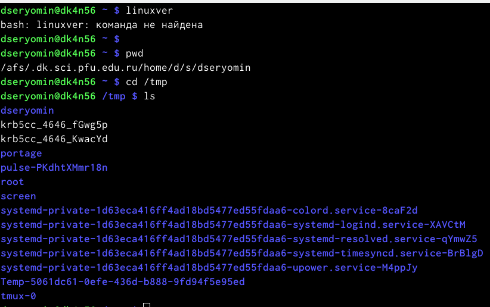
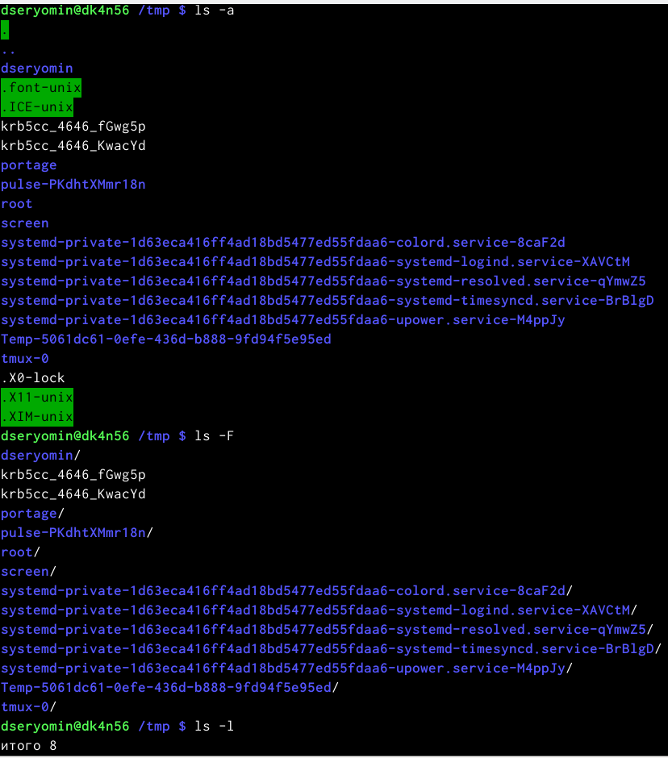
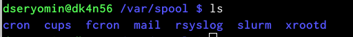
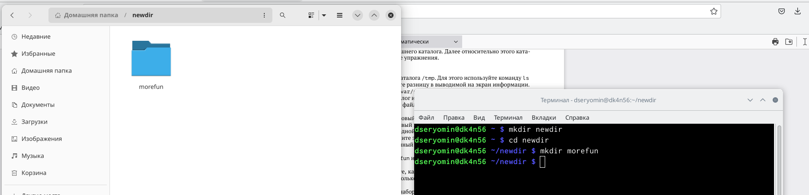
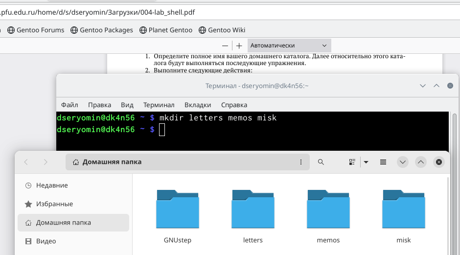

---
## Front matter
lang: ru-RU
title: Лабораторная работа 4
subtitle: "Основы интерфейса взаимодействия пользователя с системой Unix на уровне командной строки"
author:
  - Ерёмин Д.С.
institute:
  - Российский университет дружбы народов, Москва, Россия
date: 15 февраля 2023

## i18n babel
babel-lang: russian
babel-otherlangs: english

## Formatting pdf
toc: false
toc-title: Содержание
slide_level: 2
aspectratio: 169
section-titles: true
theme: metropolis
header-includes:
 - \metroset{progressbar=frametitle,sectionpage=progressbar,numbering=fraction}
 - '\makeatletter'
 - '\beamer@ignorenonframefalse'
 - '\makeatother'
---

## Цели и задачи

Приобретение практических навыков взаимодействия пользователя с системой посредством командной строки.

# Создание презентации

## Содержимое каталога tmp 

{#fig:001 width=90%}

## результат работы команды ls с разными ключами

{#fig:002 width=90%}

## cron присутствует

{#fig:003}

## создание каталога morefun

{#fig:004 width=90%}

## создание трёх каталогов

{#fig:005 width=90%}

# Результаты

Я приобрел практические навыки взаимодействия пользователя с системой посредством командной строки.

