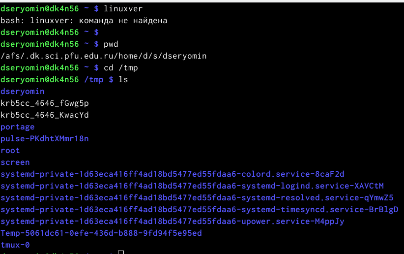
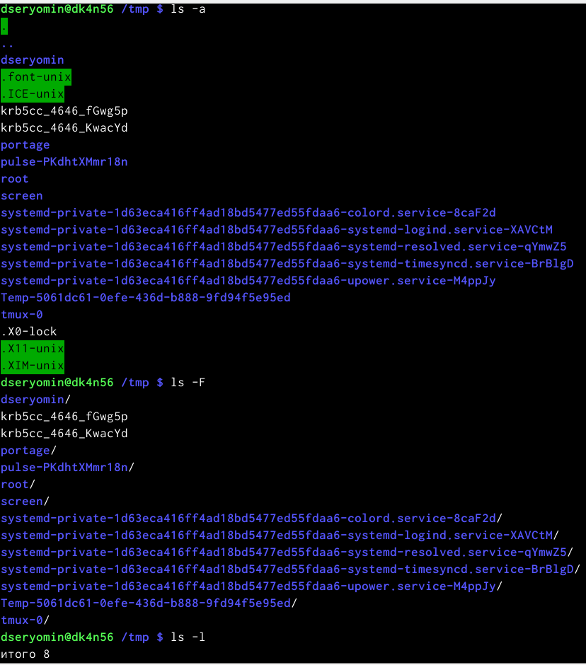
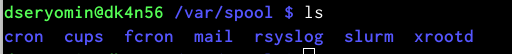
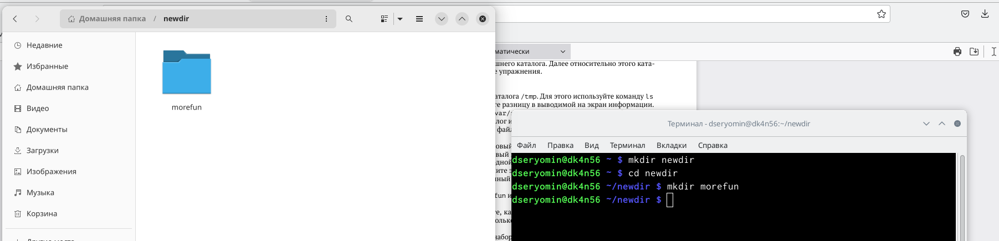
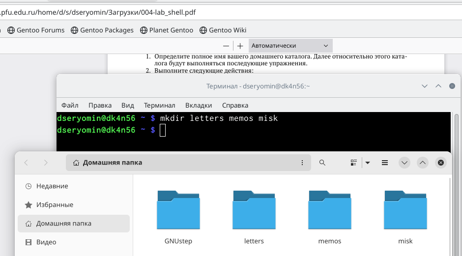

---
## Front matter
title: "Лабораторная работа 6"
subtitle: "Основы работы с Midnight Commander (mc). Структура программы на языке ассемблера NASM. Системные вызовы в ОС GNU Linux"
author: "Ерёмин Даниил"

## Generic otions
lang: ru-RU
toc-title: "Содержание"

## Bibliography
bibliography: bib/cite.bib
csl: pandoc/csl/gost-r-7-0-5-2008-numeric.csl

## Pdf output format
toc: true # Table of contents
toc-depth: 2
lof: true # List of figures
lot: false # List of tables
fontsize: 12pt
linestretch: 1.5
papersize: a4
documentclass: scrreprt
## I18n polyglossia
polyglossia-lang:
  name: russian
  options:
	- spelling=modern
	- babelshorthands=true
polyglossia-otherlangs:
  name: english
## I18n babel
babel-lang: russian
babel-otherlangs: english
## Fonts
mainfont: PT Serif
romanfont: PT Serif
sansfont: PT Sans
monofont: PT Mono
mainfontoptions: Ligatures=TeX
romanfontoptions: Ligatures=TeX
sansfontoptions: Ligatures=TeX,Scale=MatchLowercase
monofontoptions: Scale=MatchLowercase,Scale=0.9
## Biblatex
biblatex: true
biblio-style: "gost-numeric"
biblatexoptions:
  - parentracker=true
  - backend=biber
  - hyperref=auto
  - language=auto
  - autolang=other*
  - citestyle=gost-numeric
## Pandoc-crossref LaTeX customization
figureTitle: "Рис."
tableTitle: "Таблица"
listingTitle: "Листинг"
lofTitle: "Список иллюстраций"
lotTitle: "Список таблиц"
lolTitle: "Листинги"
## Misc options
indent: true
header-includes:
  - \usepackage{indentfirst}
  - \usepackage{float} # keep figures where there are in the text
  - \floatplacement{figure}{H} # keep figures where there are in the text
---

# Цель работы

Приобретение практических навыков взаимодействия пользователя с системой по-
средством командной строки.

# Выполнение лабораторной работы

1)Определяю полное имя моего домашнего каталога,после чего перехожу в каталог /tmp, вывожу на экран содержимое каталога (рис. -@fig:001)

{#fig:001 width=90%}

2) Использую команду ls с различными ключами (рис.-@fig:002) 

{#fig:002 width=90%}

3)Определяю, есть ли в каталоге /var/spool подкаталог с именем cron (рис. -@fig:003)

{#fig:003}

4)В домашнем каталоге создаю новый каталог с именем newdir,после чего создаю в нем новый каталог с именем morefun. Не забываю удалить позже newdir (рис. -@fig:004)
 
{#fig:004 width=90%}

5)В домашнем каталоге создаю одной командой три новых каталога,после чего удаляю их командой rm -r (рис. -@fig:005)

{#fig:005 width=90%}

6) С помощью команды man определяю,какую опцию команды ls нужно использовать для просмотра содержимого не только указанного каталога,но и подкаталогов,входящих в него.После этого м помощью команды man определяю набор опций команды ls,позволяющий отсортировать по времени последнего изменения выводимый список содержимого каталога с развёрнутым описанием файлов.

7) Используя информацию,полученную при помощи команды history,выполняю модификацию и исполнение нескольких команд из буфера команд 

Команды cd, pwd, mkdir, rmdir, rm и их основные опции:

    -cd ~ - перейти в домашний каталог .. - перейти в предыдущий каталог
    -pwd -L, --logical - брать директорию из переменной окружения, даже если она содержит символические ссылки -P - отбрасывать все символические ссылки
    -mkdir -m, --mode - установить права доступа для создаваемой директории -p, --parents - создать все директории, которые указаны внутри пути -v, --verbose - выводить сообщение о каждой создаваемой директории
    -rmdir и rm -r, --recursive - рекурсивно удалить содержимое каталогов
    
    Контрольные вопросы:
    1)Командой в операционной системе называется записанный по специальным правилам текст (возможно с аргументами), представляющий собой указание на выполнение какой-либо функций (или действий) в операционной системе
    2)Абсолютный путь текущего каталога можно определить с помощью команды pwd
    3)Только тип файлов и их имена в текущем каталоге можно определить с помощью команды ls и опции -F
    4)Информации о скрытых файлах можно отобразить с помощью команды ls и опции -a
    5)Файлы можно удалить с помощью команды rm, а каталоги с помощью команды rm и опции -r
    6)Информацию о последних выполненных пользователем командах можно вывести с помощью команды history
    7)Можно модифицировать команду из выведенного на экран списка при помощи следующей конструкции: !(номер команды):s/(что меняем)/(на что меняем)
    8)Несколько команд запускаются в одной строке, если между ними поставить точку с запятой
    9)Экранирование символов — замена в тексте управляющих символов на соответствующие текстовые подстановки
    10)Относительный путь к файлу указывается из каталога, в котором находится пользователь. Абсолютный путь к файлу начинается с корневого каталога, например: /afs/.dk.sci.pfu.edu.ru/home/l/a/lavorobchuk
    11)Информацию об интересующей команде можно получить с помощью команды man
    12)Для автоматического дополнения вводимых команд служит клавиша Tab

# Выводы

В ходе выполнения данной лабораторной работы я постигла основы интерфейса взаимодействия пользователя с системой Unix на уровне командной строки.

