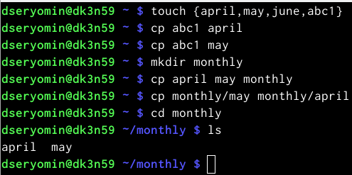
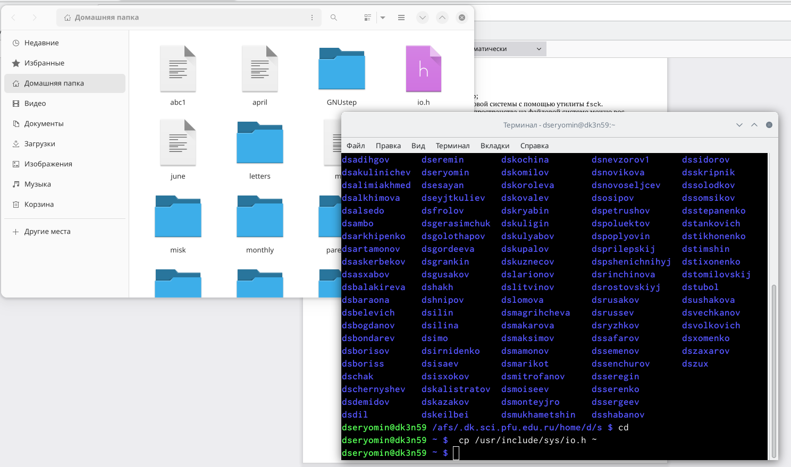
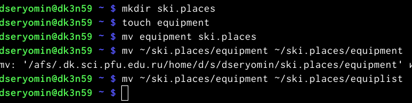
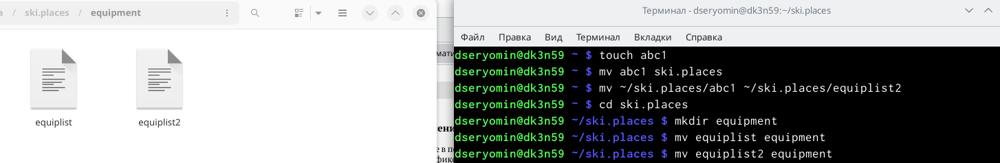
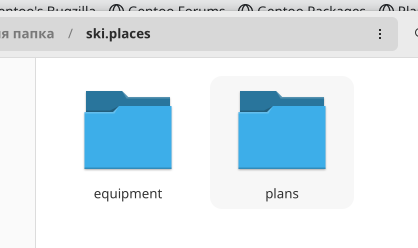
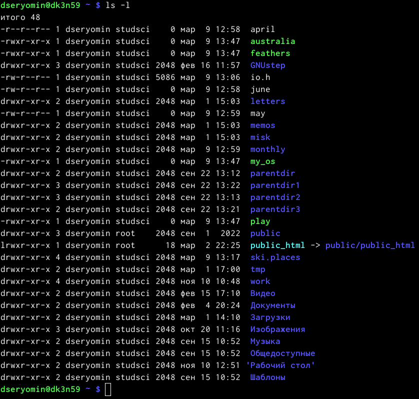

---
## Front matter
lang: ru-RU
title: "Лабораторная работа 5"
subtitle: "Анализ файловой системы Linux. Команды для работы с файлами и каталогами"
author: "Ерёмин Даниил"

## i18n babel
babel-lang: russian
babel-otherlangs: english

## Formatting pdf
toc: false
toc-title: Содержание
slide_level: 2
aspectratio: 169
section-titles: true
theme: metropolis
header-includes:
 - \metroset{progressbar=frametitle,sectionpage=progressbar,numbering=fraction}
 - '\makeatletter'
 - '\beamer@ignorenonframefalse'
 - '\makeatother'
---

## Цели и задачи

Ознакомление с файловой системой Linux, её структурой, именами и содержанием каталогов. Приобретение практических навыков по применению команд для работы с файлами и каталогами, по управлению процессами (и работами), по проверке использования диска и обслуживанию файловой системы.

# Создание презентации

## Выполнение примеров

{#fig:001 width=90%}

## Перенос файла io.h

{#fig:002 width=90%}

## Работа с файлом

{#fig:003}

## результат простейших команд

{#fig:004 width=90%}

## новый каталог

{#fig:005 width=90%}

## результат работы команд chmod

{#fig:006 width=90%}

# Результаты

Я ознакомился с файловой системой Linux, её структурой, именами и содержанием каталогов. Приобрел практические навыки по применению команд для работы с файлами и каталогами, по управлению процессами (и работами), по проверке использования диска и обслуживанию файловой системы.

