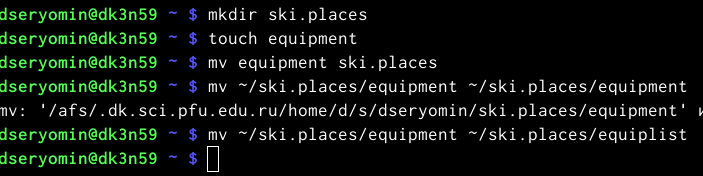
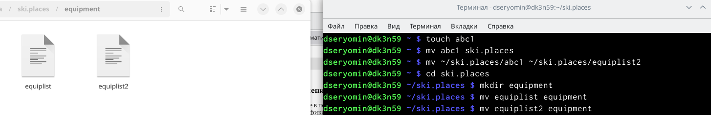
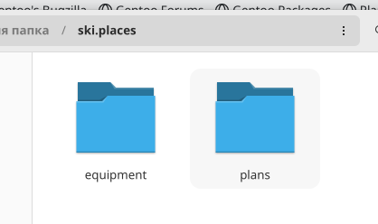
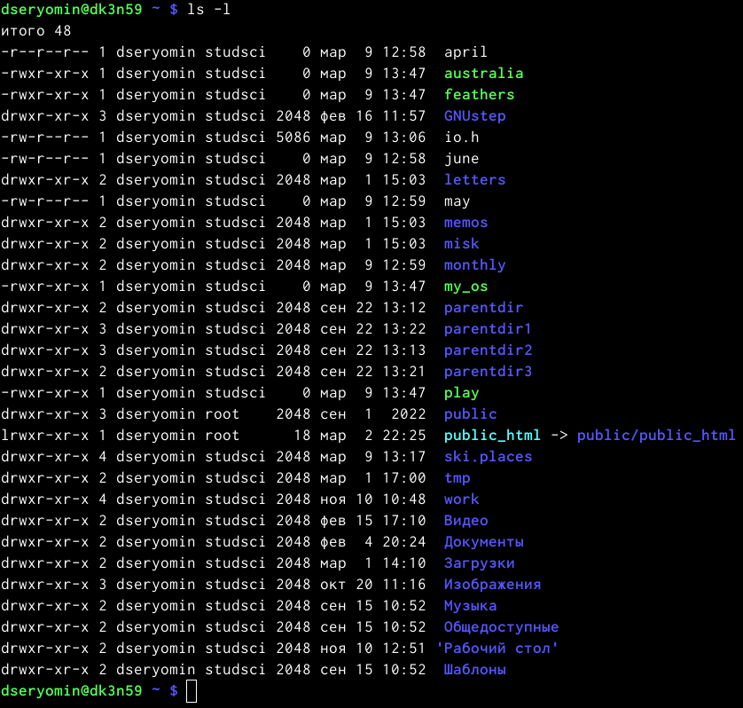

---
## Front matter
title: "Лабораторная работа 5"
subtitle: "Анализ файловой системы Linux. Команды для работы с файлами и каталогами"
author: "Ерёмин Даниил"

## Generic otions
lang: ru-RU
toc-title: "Содержание"

## Bibliography
bibliography: bib/cite.bib
csl: pandoc/csl/gost-r-7-0-5-2008-numeric.csl

## Pdf output format
toc: true # Table of contents
toc-depth: 2
lof: true # List of figures
lot: true # List of tables
fontsize: 12pt
linestretch: 1.5
papersize: a4
documentclass: scrreprt
## I18n polyglossia
polyglossia-lang:
  name: russian
  options:
	- spelling=modern
	- babelshorthands=true
polyglossia-otherlangs:
  name: english
## I18n babel
babel-lang: russian
babel-otherlangs: english
## Fonts
mainfont: PT Serif
romanfont: PT Serif
sansfont: PT Sans
monofont: PT Mono
mainfontoptions: Ligatures=TeX
romanfontoptions: Ligatures=TeX
sansfontoptions: Ligatures=TeX,Scale=MatchLowercase
monofontoptions: Scale=MatchLowercase,Scale=0.9
## Biblatex
biblatex: true
biblio-style: "gost-numeric"
biblatexoptions:
  - parentracker=true
  - backend=biber
  - hyperref=auto
  - language=auto
  - autolang=other*
  - citestyle=gost-numeric
## Pandoc-crossref LaTeX customization
figureTitle: "Рис."
tableTitle: "Таблица"
listingTitle: "Листинг"
lofTitle: "Список иллюстраций"
lotTitle: "Список таблиц"
lolTitle: "Листинги"
## Misc options
indent: true
header-includes:
  - \usepackage{indentfirst}
  - \usepackage{float} # keep figures where there are in the text
  - \floatplacement{figure}{H} # keep figures where there are in the text
---

# Цель работы

Ознакомление с файловой системой Linux, её структурой, именами и содержанием каталогов. Приобретение практических навыков по применению команд для работы с файлами и каталогами, по управлению процессами (и работами), по проверке использования диска и обслуживанию файловой системы.

# Выполнение лабораторной работы

1) Изучим и перепишем примеры из файла лабораторной работы (рис. -@fig:001)

{#fig:001 width=90%}

2) Перейдем в каталог usr и перенесем файл io.h в домашний каталог (рис.-@fig:002) 

{#fig:002 width=90%}

3) Создадим каталог,перенесем в него файл и переименуем (рис. -@fig:003)

{#fig:003}

4) С помощью команд mkdir,mv,cp выполним оставшиеся действия и посмотрим как выглядит каталог внутри файловой системы (рис. -@fig:004)

{#fig:004 width=90%}

5) Создадим каталог newdir, переместим его в каталог ski.places и переименуем в plans (рис. -@fig:005)

{#fig:005 width=90%}

6) С помощью команды chmod зададим необходимые права файлам и посмотрим на итоговый вид всех файлов (рис. -@fig:006)

{#fig:006 width=90%}

7) Выполняем упражнения из пункта 4 лабораторной работы и понимаем, что есть у файла или каталога отобрать права на чтение,то после команды cat будет ошибка. Ошибка также будет после перехода в каталог в случае отсутствия прав на выполнение.

8) С помощью команды man посмотрим команды. mount-Команда mount служит для присоединения файловой системы, найденной на каком-либо устройстве, к большому файловому дереву. fsck- Проверяет файловую систему на целостность и ошибки. mkfs- mkfs используется для создания файловой системы Linux на устройстве, обычно это раздел жесткого диска. kill-убить процесс.

Контрольные вопросы: 

1) Ext2, Ext3, Ext4 или Extended Filesystem - это стандартная файловая система для Linux. Она была разработана еще для Minix. Она самая стабильная из всех существующих, кодовая база изменяется очень редко и эта файловая система содержит больше всего функций. Версия ext2 была разработана уже именно для Linux и получила много улучшений.
2) / — root каталог. Содержит в себе всю иерархию системы; /bin — здесь находятся двоичные исполняемые файлы. Основные общие команды, хранящиеся отдельно от других программ в системе (прим.: pwd, ls, cat, ps); /boot — тут расположены файлы, используемые для загрузки системы (образ initrd, ядро vmlinuz); /dev — в данной директории располагаются файлы устройств (драйверов). С помощью этих файлов можно взаимодействовать с устройствами. К примеру, если это жесткий диск, можно подключить его к файловой системе. В файл принтера же можно написать напрямую и отправить задание на печать; /etc — в этой директории находятся файлы конфигураций программ. Эти файлы позволяют настраивать системы, сервисы, скрипты системных демонов; /home — каталог, аналогичный каталогу Users в Windows. Содержит домашние каталоги учетных записей пользователей (кроме root). При создании нового пользователя здесь создается одноименный каталог с аналогичным именем и хранит личные файлы этого пользователя; /lib — содержит системные библиотеки, с которыми работают программы и модули ядра; /lost+found — содержит файлы, восстановленные после сбоя работы системы. Система проведет проверку после сбоя и найденные файлы можно будет посмотреть в данном каталоге; /media — точка монтирования внешних носителей. Например, когда вы вставляете диск в дисковод, он будет автоматически смонтирован в директорию /media/cdrom; /mnt — точка временного монтирования. Файловые системы подключаемых устройств обычно монтируются в этот каталог для временного использования; /opt — тут расположены дополнительные (необязательные) приложения. Такие программы обычно не подчиняются принятой иерархии и хранят свои файлы в одном подкаталоге (бинарные, библиотеки, конфигурации); /proc — содержит файлы, хранящие информацию о запущенных процессах и о состоянии ядра ОС; /root — директория, которая содержит файлы и личные настройки суперпользователя; /run — содержит файлы состояния приложений. Например, PID-файлы или UNIX-сокеты; /sbin — аналогично /bin содержит бинарные файлы. Утилиты нужны для настройки и администрирования системы суперпользователем; /srv — содержит файлы сервисов, предоставляемых сервером (прим. FTP или Apache HTTP); /sys — содержит данные непосредственно о системе. Тут можно узнать информацию о ядре, драйверах и устройствах; /tmp — содержит временные файлы. Данные файлы доступны всем пользователям на чтение и запись. Стоит отметить, что данный каталог очищается при перезагрузке; /usr — содержит пользовательские приложения и утилиты второго уровня, используемые пользователями, а не системой. Содержимое доступно только для чтения (кроме root). Каталог имеет вторичную иерархию и похож на корневой; /var — содержит переменные файлы. Имеет подкаталоги, отвечающие за отдельные переменные. Например, логи будут храниться в /var/log, кэш в /var/cache, очереди заданий в /var/spool/ и так далее.
3) Монтирование тома.
4) Один блок адресуется несколькими mode (принадлежит нескольким файлам). Блок помечен как свободный, но в то же время занят (на него ссылается onode). Блок помечен как занятый, но в то же время свободен (ни один inode на него не ссылается). Неправильное число ссылок в inode (недостаток или избыток ссылающихся записей в каталогах). Несовпадение между размером файла и суммарным размером адресуемых inode блоков. Недопустимые адресуемые блоки (например, расположенные за пределами файловой системы). "Потерянные" файлы (правильные inode, на которые не ссылаются записи каталогов). Недопустимые или неразмещенные номера inode в записях каталогов.
5) mkfs - позволяет создать файловую систему Linux.
6) Cat - выводит содержимое файла на стандартное устройство вывода
7) Cp – копирует или перемещает директорию, файлы.
8) Mv - переименовать или переместить файл или директорию
9) Права доступа к файлу или каталогу можно изменить, воспользовавшись командой chmod. Сделать это может владелец файла (или каталога) или пользователь с правами администратора.

# Выводы

Я ознакомился с файловой системой Linux, её структурой, именами и содержанием каталогов. Приобрел практические навыки по применению команд для работы с файлами и каталогами, по управлению процессами (и работами), по проверке использования диска и обслуживанию файловой системы.

