---
## Front matter
lang: ru-RU
title: "Лабораторная работа 6"
subtitle: "Поиск файлов. Перенаправление ввода-вывода.Просмотр запущенных процессов"
author: "Ерёмин Даниил"

## i18n babel
babel-lang: russian
babel-otherlangs: english

## Formatting pdf
toc: false
toc-title: Содержание
slide_level: 2
aspectratio: 169
section-titles: true
theme: metropolis
header-includes:
 - \metroset{progressbar=frametitle,sectionpage=progressbar,numbering=fraction}
 - '\makeatletter'
 - '\beamer@ignorenonframefalse'
 - '\makeatother'
---

## Цели и задачи

Ознакомление с инструментами поиска файлов и фильтрации текстовых данных.
Приобретение практических навыков: по управлению процессами (и заданиями), по
проверке использования диска и обслуживанию файловых систем.

# Создание презентации

## запись названия файлов

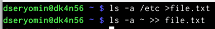{#fig:001 width=90%}

## вывод имен файлов и их запись

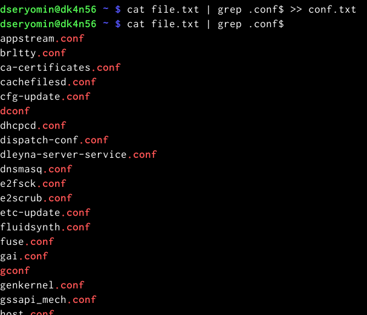{#fig:002 width=90%}

## определение файлов

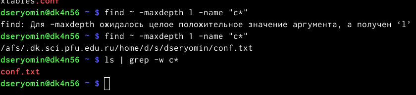{#fig:003}

## вывод файлов начинающихся с h

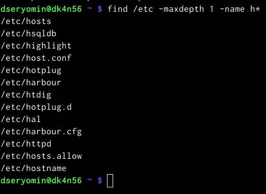{#fig:004 width=90%}

## запуск процесса в фоновом режиме

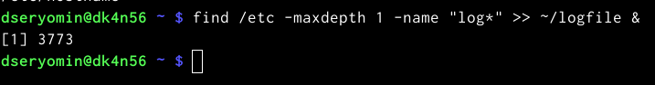{#fig:005 width=90%}

## результат работы команды rm

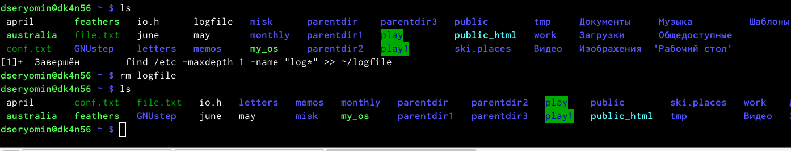{#fig:006 width=90%}

## определение идентификатора процесса gedit

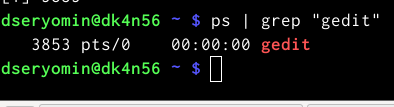{#fig:007 width=90%}

## определение идентификаторов запущенных процессов

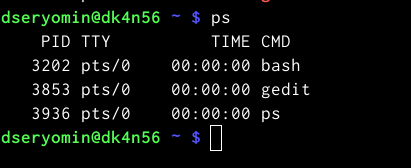{#fig:008 width=90%}

## результат команды kill

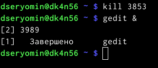{#fig:009 width=90%}

## команда df

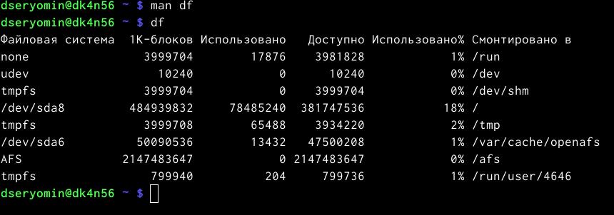{#fig:010 width=90%}

## команда du

{#fig:011 width=90%}

## результат команды find

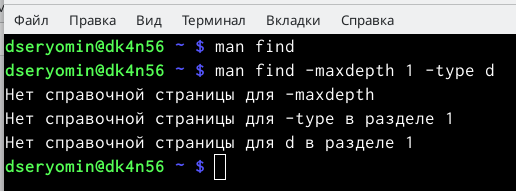{#fig:012 width=90%}

## Результаты

Я ознакомился с файловой системой Linux, её структурой, именами и содержанием каталогов. Приобрел практические навыки по применению команд для работы с файлами и каталогами, по управлению процессами (и работами), по проверке использования диска и обслуживанию файловой системы.

