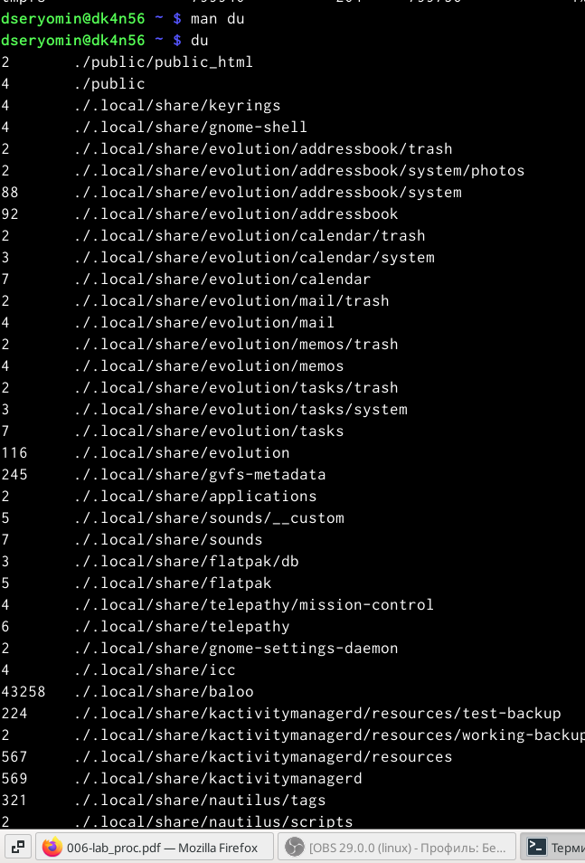

---
## Front matter
title: "Лабораторная работа 6"
subtitle: "Поиск файлов. Перенаправление ввода-вывода.Просмотр запущенных процессов"
author: "Ерёмин Даниил"

## Generic otions
lang: ru-RU
toc-title: "Содержание"

## Bibliography
bibliography: bib/cite.bib
csl: pandoc/csl/gost-r-7-0-5-2008-numeric.csl

## Pdf output format
toc: true # Table of contents
toc-depth: 2
lof: true # List of figures
lot: true # List of tables
fontsize: 12pt
linestretch: 1.5
papersize: a4
documentclass: scrreprt
## I18n polyglossia
polyglossia-lang:
  name: russian
  options:
	- spelling=modern
	- babelshorthands=true
polyglossia-otherlangs:
  name: english
## I18n babel
babel-lang: russian
babel-otherlangs: english
## Fonts
mainfont: PT Serif
romanfont: PT Serif
sansfont: PT Sans
monofont: PT Mono
mainfontoptions: Ligatures=TeX
romanfontoptions: Ligatures=TeX
sansfontoptions: Ligatures=TeX,Scale=MatchLowercase
monofontoptions: Scale=MatchLowercase,Scale=0.9
## Biblatex
biblatex: true
biblio-style: "gost-numeric"
biblatexoptions:
  - parentracker=true
  - backend=biber
  - hyperref=auto
  - language=auto
  - autolang=other*
  - citestyle=gost-numeric
## Pandoc-crossref LaTeX customization
figureTitle: "Рис."
tableTitle: "Таблица"
listingTitle: "Листинг"
lofTitle: "Список иллюстраций"
lotTitle: "Список таблиц"
lolTitle: "Листинги"
## Misc options
indent: true
header-includes:
  - \usepackage{indentfirst}
  - \usepackage{float} # keep figures where there are in the text
  - \floatplacement{figure}{H} # keep figures where there are in the text
---

# Цель работы

Ознакомление с инструментами поиска файлов и фильтрации текстовых данных.
Приобретение практических навыков: по управлению процессами (и заданиями), по
проверке использования диска и обслуживанию файловых систем.

# Выполнение лабораторной работы

1) Осуществляю вход в систему,используя соответствующее имя пользователя.

2) Записываю в файл file.txt названия файлов,содержащихся в каталоге /etc. Затем дописываю в этот же файл названия файлов,содержащихся в моем домашнем каталоге (рис. -@fig:001)

{#fig:001 width=90%}

3) Вывожу имена всех файлов из file.txt,имеющих расширение .conf, и записываю их новый текстовый файл conf.txt (рис.-@fig:002) 

{#fig:002 width=90%}

4) Определяю какие файлы в домашнем каталоге имеют имена,начинавшиеся с символа c,используя grep и find (рис. -@fig:003)

{#fig:003}

5) Вывожу на экран имена файлов из каталога /etc,начинающиеся с символа h,используя команду find (рис. -@fig:004)

{#fig:004 width=90%}

6) Запускаю в фоновом режиме процесс,который записывает в файл ~/logfile файлы,которые начинаются с log (рис. -@fig:005)

{#fig:005 width=90%}

7) Удаляю файл ~/logfile,используя команду rm (рис. -@fig:006)

{#fig:006 width=90%}

8)Запускаю из консоли в фоновом режиме редактор gedit и определяю идентификатор процесса(ps),конвейер и фильтр grep.Также определяю идентификаторы всех запущенных процессов(ps) (рис. -@fig:007)

{#fig:007 width=90%}

(рис. -@fig:008)

{#fig:008 width=90%}

9)Получаю справку команды kill с помощью команды man,после чего использую ее для завершения процесса gedit (рис. -@fig:009)

{#fig:009 width=90%}

10) Выполняю команды df и du,предварительно получив по ним информацию командой man (рис. -@fig:010)

{#fig:010 width=90%}

(рис. -@fig:011)

{#fig:011 width=90%}

11) Используя справку команды find,вывожу имена всех директорий из домашнего каталога (рис. -@fig:012)

{#fig:012 width=90%}

# Выводы

Я ознакомился с инструментами поиска файлов и фильтрации текстовых данных.
Приобрёл практические навыки: по управлению процессами (и заданиями), по
проверке использования диска и обслуживанию файловых систем.
