---
## Front matter
lang: ru-RU
title: "Лабораторная работа 7"
subtitle: "Командная оболочка Midnight Commander"
author: "Ерёмин Даниил"

## i18n babel
babel-lang: russian
babel-otherlangs: english

## Formatting pdf
toc: false
toc-title: Содержание
slide_level: 2
aspectratio: 169
section-titles: true
theme: metropolis
header-includes:
 - \metroset{progressbar=frametitle,sectionpage=progressbar,numbering=fraction}
 - '\makeatletter'
 - '\beamer@ignorenonframefalse'
 - '\makeatother'
---

## Цели и задачи

Освоение основных возможностей командной оболочки Midnight Commander. Приобретение навыков практической работы по просмотру каталогов и файлов; манипуляций с ними.

# Создание презентации

## справка по команде mc

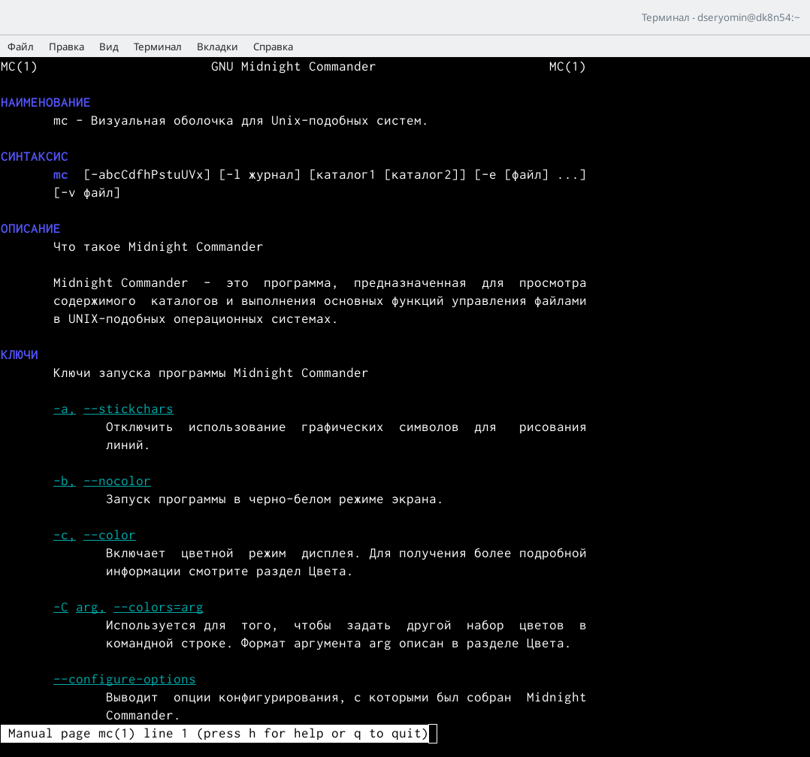{#fig:001 width=90%}

## запуск mc

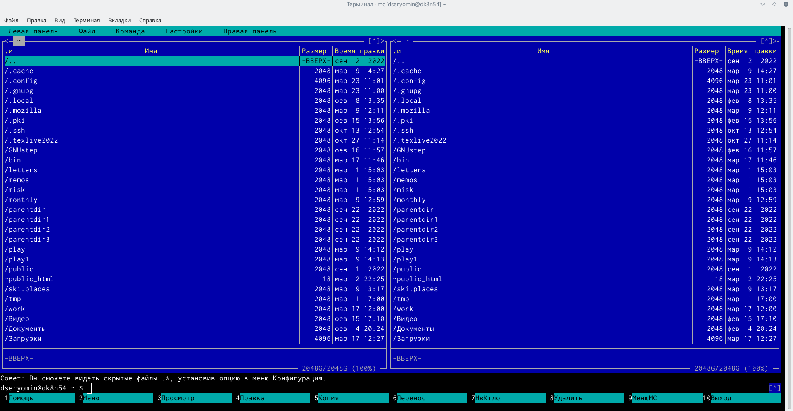{#fig:002 width=90%}

## выделение нескольких файлов

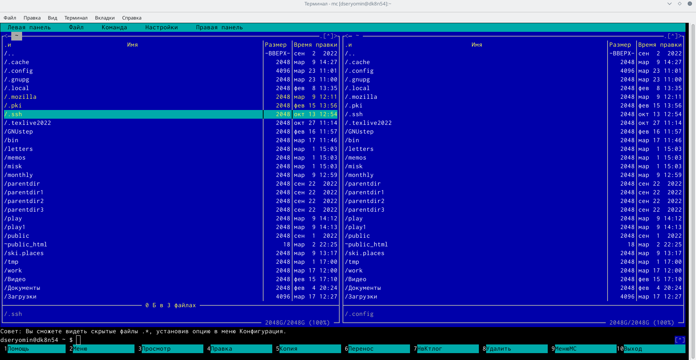{#fig:003 width=90%}

## копирование файлов

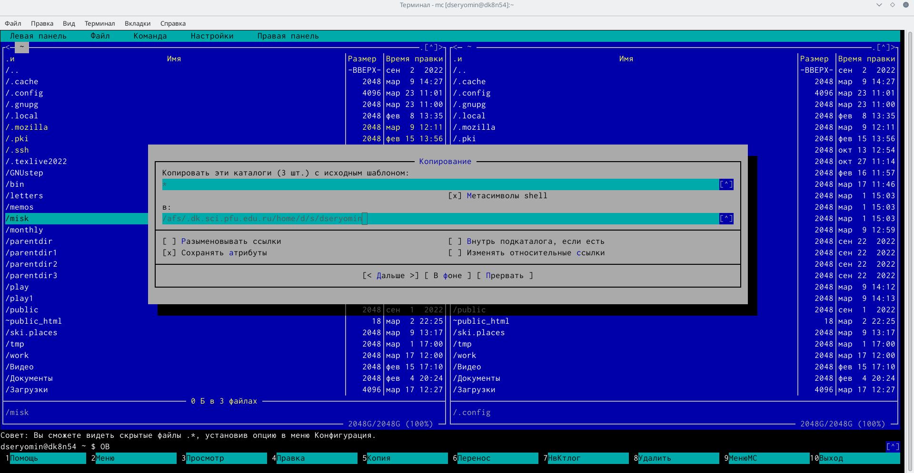{#fig:004 width=90%}

## перемещение файлов

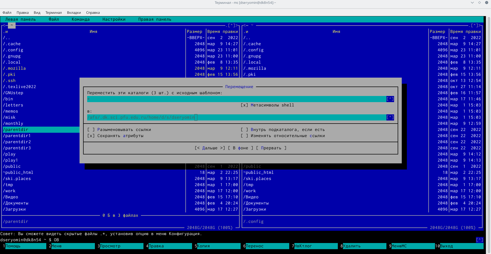{#fig:005 width=90%}

## просматриваю содержимое текстового файла

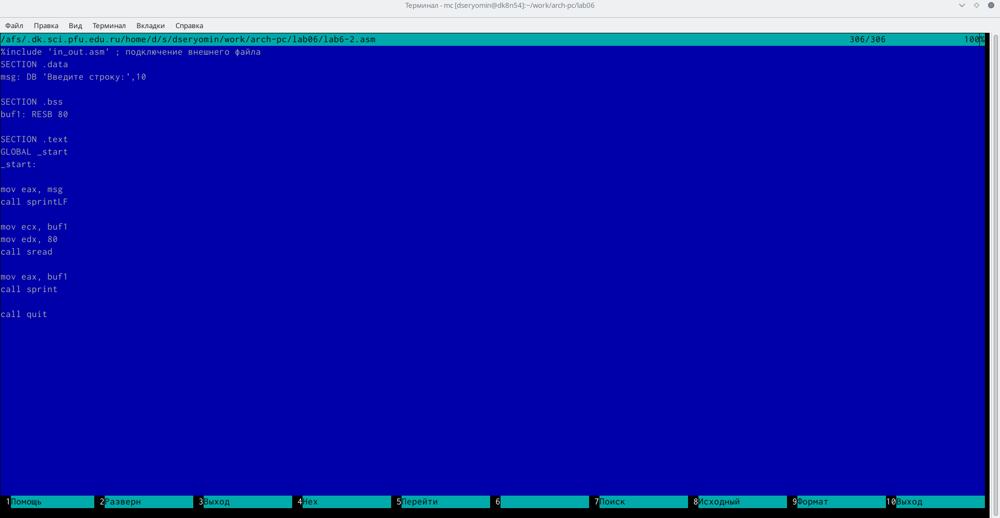{#fig:006 width=90%}

## редактирую содержимое текстового файла

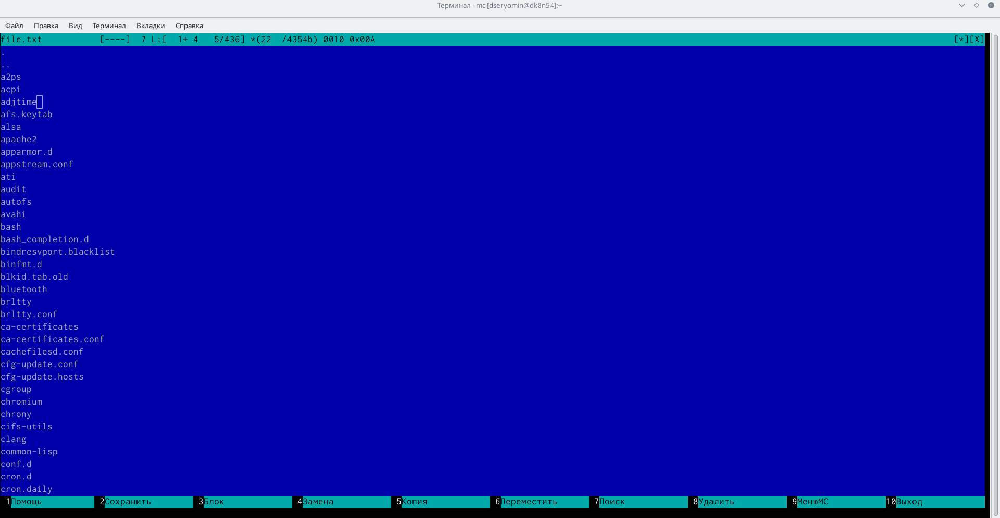{#fig:007 width=90%}

## создаю текстовый файл

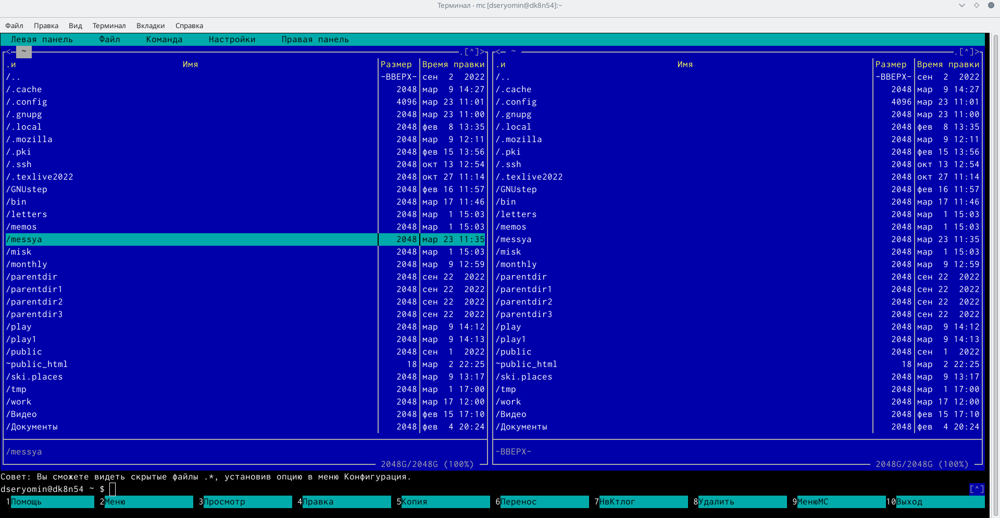{#fig:008 width=90%}

## копирую файлы в созданный каталог

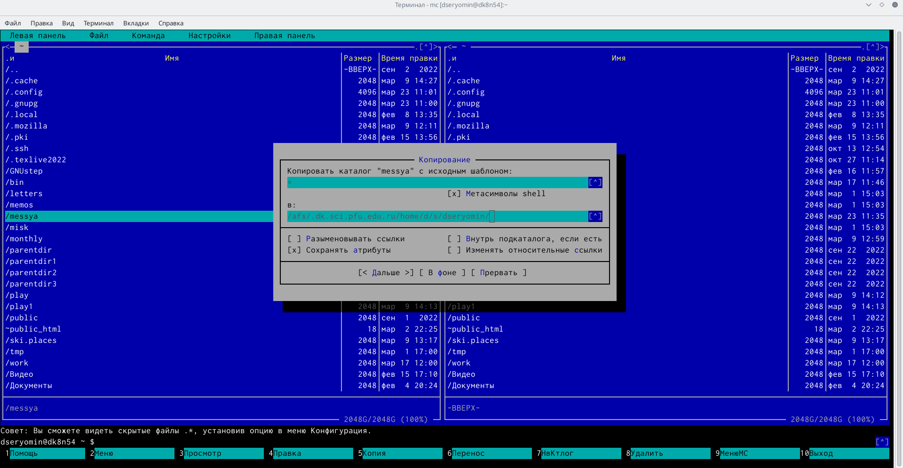{#fig:009 width=90%}

## осуществляю поиск в файловой системе файла с заданными условиями

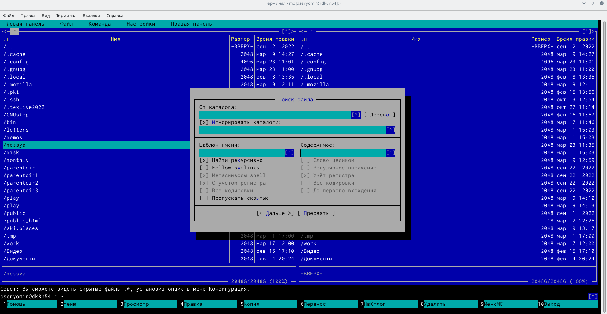{#fig:010 width=90%}

## перехожу в домашний каталог через дерево каталогов

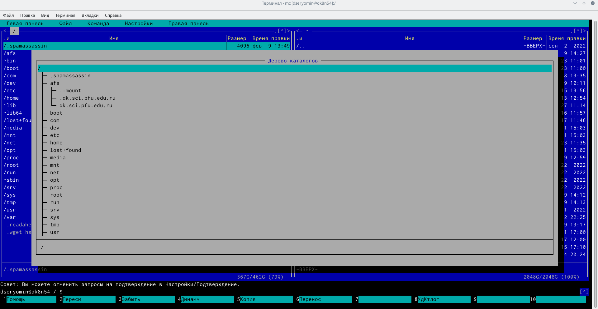{#fig:011 width=90%}

## добавил домашний каталог в каталоги быстрого доступа

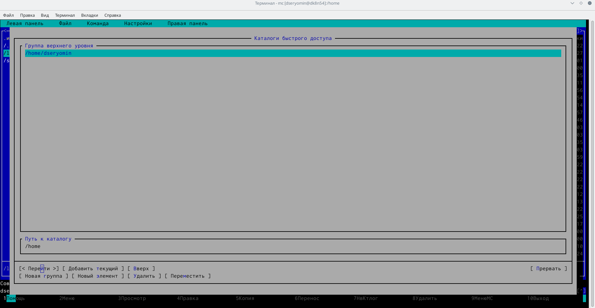{#fig:012 width=90%}

## настройки

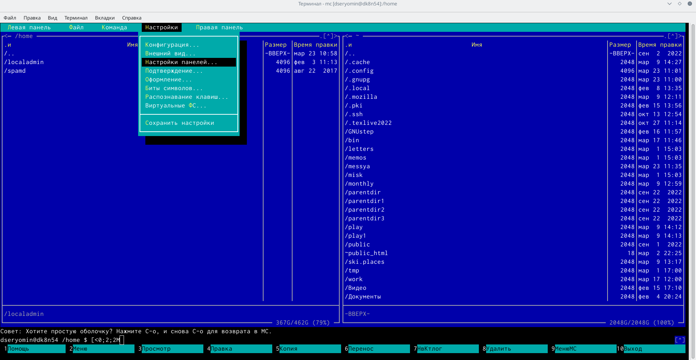{#fig:013 width=90%}

## команда f6

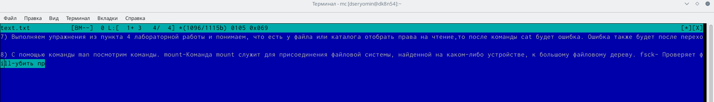{#fig:014 width=90%}

## Результаты

Я освоил основные возможности командной оболочки Midnight Commander. Приобретел навыки практической работы по просмотру каталогов и файлов; манипуляций с ними.

