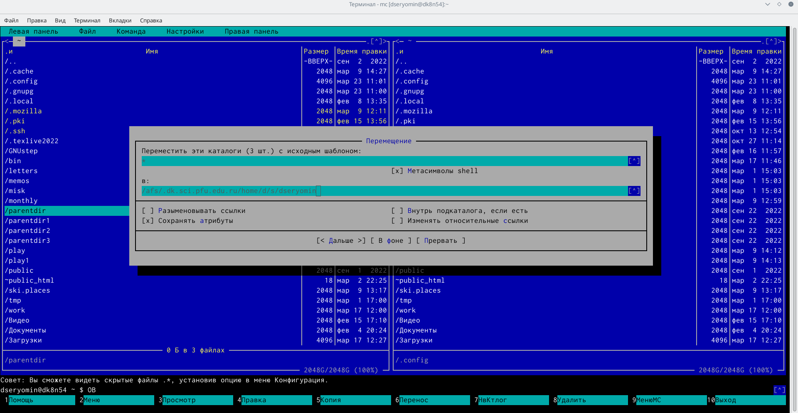

---
## Front matter
title: "Лабораторная работа 7"
subtitle: "Командная оболочка Midnight Commander"
author: "Ерёмин Даниил"

## Generic otions
lang: ru-RU
toc-title: "Содержание"

## Bibliography
bibliography: bib/cite.bib
csl: pandoc/csl/gost-r-7-0-5-2008-numeric.csl

## Pdf output format
toc: true # Table of contents
toc-depth: 2
lof: true # List of figures
lot: true # List of tables
fontsize: 12pt
linestretch: 1.5
papersize: a4
documentclass: scrreprt
## I18n polyglossia
polyglossia-lang:
  name: russian
  options:
	- spelling=modern
	- babelshorthands=true
polyglossia-otherlangs:
  name: english
## I18n babel
babel-lang: russian
babel-otherlangs: english
## Fonts
mainfont: PT Serif
romanfont: PT Serif
sansfont: PT Sans
monofont: PT Mono
mainfontoptions: Ligatures=TeX
romanfontoptions: Ligatures=TeX
sansfontoptions: Ligatures=TeX,Scale=MatchLowercase
monofontoptions: Scale=MatchLowercase,Scale=0.9
## Biblatex
biblatex: true
biblio-style: "gost-numeric"
biblatexoptions:
  - parentracker=true
  - backend=biber
  - hyperref=auto
  - language=auto
  - autolang=other*
  - citestyle=gost-numeric
## Pandoc-crossref LaTeX customization
figureTitle: "Рис."
tableTitle: "Таблица"
listingTitle: "Листинг"
lofTitle: "Список иллюстраций"
lotTitle: "Список таблиц"
lolTitle: "Листинги"
## Misc options
indent: true
header-includes:
  - \usepackage{indentfirst}
  - \usepackage{float} # keep figures where there are in the text
  - \floatplacement{figure}{H} # keep figures where there are in the text
---

# Цель работы

Освоение основных возможностей командной оболочки Midnight Commander. Приобретение навыков практической работы по просмотру каталогов и файлов; манипуляций с ними.

# Выполнение лабораторной работы

1) Изучаю информацию о mc,вызвав в командной строке man mc (рис. -@fig:001)

{#fig:001 width=90%}

2) Запускаю mc из терминала и изучаю его меню и структуру (рис. -@fig:002)

{#fig:002 width=90%}

3) Выполняю несколько операций в mc,используя управляющие клавиши (рис. -@fig:003)

{#fig:003 width=90%}

(рис. -@fig:004)

{#fig:004 width=90%}

(рис. -@fig:005)

{#fig:005 width=90%}

4) Выполняю основные команды меню левой или правой панели. Просматриваю список файлов выбранного каталога,дерево каталогов, а также более подробную информацию о файлах

5) Используя возможности подменю команда выполняю некоторые действия (рис. -@fig:006)

{#fig:006 width=90%}

(рис. -@fig:007)

{#fig:007 width=90%}

(рис. -@fig:008)

{#fig:008 width=90%}

(рис. -@fig:009)

{#fig:009 width=90%}

6) С помощью соответствующих средств подменю команда выполняю определенные действия (рис. -@fig:010)

{#fig:010 width=90%}

(рис. -@fig:011)

{#fig:011 width=90%}

(рис. -@fig:012)

{#fig:012 width=90%}

7) Вызываю подменю настройки и осваиваю операции,определяющие структуру экрана mc (рис. -@fig:013)

{#fig:013 width=90%}

ЗАДАНИЕ ПО ВСТРОЕННОМУ РЕДАКТОРУ MC:

8) Создаю текстовый файл file.txt,затем с помощью текстового редактора открываю этот файл и копирую некоторый текст из описания лабораторной работы и вставляю в файл text.txt 

9) Удаляю строку текста,выделяю фрагмент текста с помощью клавиши f3 и копирую его с помощью клавиши f5, после чего выделяю фрагмент текста и перемещаю его на другую строку клавишей f6 (рис. -@fig:014)

{#fig:014 width=90%}

10) Сохраняю файл клавишей f2,отменяю последнее действие с помощью комбинации клавиш ctrl + u,перехожу в конец файла и пишу некоторый текст,после чего сохраняю файл (рис. -@fig:015)

{#fig:015 width=90%}

11) Открываю файл с исходным текстом на языке программирования C++ и используя меню выключаю подстветку синтаксиса (рис. -@fig:016)

{#fig:016 width=90%}

КОНТРОЛЬНЫЕ ВОПРОСЫ: 
 
 
    1)Какие режимы работы есть в mc. Охарактеризуйте их.

mc - визуальная файловая оболочка для UNIX/Linux систем, аналог Far, Norton Commander, но оболочки в Linux несравненно богаче. На языке командной оболочки можно писать небольшие программы для выполнения ряда последовательных операций с файлами и содержащимися в них данными.

Команда Переставить панели (Ctrl+U) меняет местами содержимое правой и левой панелей.

По команде Сравнить каталоги (Ctrl-X,D) сравнивается содержимое каталогов, отображаемых на левой и правой панелях.

Помимо того, что может задаваться формат вывода на панель списка файлов, любую панель можно перевести в один из следующих режимов Режим "Информация". В этом режиме на панель выводится информация о подсвеченном в другой панели файле и о текущей файловой системе.

Режим "Дерево". В режиме отображения дерева каталогов в одной из панелей выводится графическое изображение структуры дерева каталогов.

Меню «Левая панель» и «Правая панель» позволяют оперировать режимами отображения панелей.

Формат списка бывает:

Стандартный – вывод списка файлов и каталогов по умолчанию;

Ускоренный – имена файла или каталогов; Расширенный – атрибуты, владелец, группа и размер;

Определённый пользователем – имя, размер и атрибуты; Быстрый просмотр – выполняет быстрый просмотр содержимого панели.

Информация – выдает всю имеющуюся информацию о файле или каталоге.

Порядок сортировки – бывает: без сортировки, по имени, расширенный, время правки, время правки, время доступа, время изменение атрибута, размер, узел.

   2) Какие операции с файлами можно выполнить как с помощью команд shell, так и с помощью меню (комбинаций клавиш) mc? Приведите несколько примеров.

Командные интерпретатор Shell и оболочка Midnight Commander имеют похожую структуру и многие одинаковые команды можно выполнить в обоих оболочках:

Например, Системная информация, Копирование, Поиск

    3) Опишите структура меню левой (или правой) панели mc, дайте характеристику командам.

Подпункты меню:

Список файлов показывает файлы в домашнем каталоге.

Быстрый просмотр позволяет выполнить быстрый просмотр содержимого панели.

Информация позволяет посмотреть информацию о файле или каталоге

В меню каждой (левой или правой) панели можно выбрать

Формат списка: стандартный, ускоренный, расширенный и определённый пользователем.

Порядок сортировки позволяет задать критерии сортировки при выводе списка файлов и каталогов: без сортировки, по имени, расширенный, время правки, время доступа, время изменения атрибута, размер, узел.

    4)Опишите структура меню Файл mc, дайте характеристику командам.

Просмотр (F3) позволяет посмотреть содержимое текущего файла без возможности редактирования.

Просмотр вывода команды (М + !) функция запроса команды с параметрами.

Правка (F4) открывает текущий (или выделенный) файл для его редактирования.

Копирование (F5) осуществляет копирование одного или нескольких файлов или каталогов в указанное пользователем во всплывающем окне место.

Права доступа (Ctrl-x c) позволяет изменить права доступа к одному или нескольким файлам или каталогам.

Переименование (F6) позволяет переименовать один или несколько файлов или каталогов.

Создание каталога (F7) позволяет создать каталог.

Удалить (F8) позволяет удалить один или несколько файлов или каталогов.
Выход (F10) завершает работу mc.

   5) Опишите структура меню Команда mc, дайте характеристику командам.

Подпункты меню:

Дерево каталогов отображает структуру каталогов системы.

Поиск файла выполняет поиск файлов по заданным параметрам.

Переставить панели меняет местами левую и правую панели.

Сравнить каталоги ( Ctrl-x d ) сравнивает содержимое двух каталогов.

Размеры каталогов отображает размер и время изменения каталога (по умол- чанию в mc размер каталога корректно не отображается).

История командной строки выводит на экран список ранее выполненных в оболочке команд.

Каталоги быстрого доступа ( Ctrl-\ ) при вызове выполняется быстрая смена текущего каталога на один из заданного списка. Восстановление файлов позволяет восстановить файлы на файловых систе- мах ext2 и ext3.
Редактировать файл расширений позволяет задать с помощью определённого синтаксиса действия при запуске файлов с определённым расширением (напри- мер, какое программного обеспечение запускать для открытия или редактирова- ния файлов с расширением .c или .cpp).

Редактировать файл меню позволяет отредактировать контекстное меню поль- зователя, вызываемое по клавише F2 . Редактировать файл расцветки имён позволяет подобрать оптимальную для пользователя расцветку имён файлов в зависимости от их типа.

    6)Опишите структура меню Настройки mc, дайте характеристику командам.

Подпункты меню:

Конфигурация позволяет скорректировать настройки работы с панелями.

Внешний вид и Настройки панелей определяет элементы, отображаемые при вызове mc, а также цветовое выделение.

Биты символов задаёт формат обработки информации локальным термина- лом.

Подтверждение позволяет установить или убрать вывод окна с запросом подтверждения действий при операциях удаления и перезаписи файлов, а также при выходе из программы.

    7)Назовите и дайте характеристику встроенным командам mc.

F1 – Вызов контекстно-зависимой подсказки.

F2 – Вызов пользовательского меню с возможностью создания and/or.

F3 – dfgПросмотр содержимого файла, на который указывает подсветка в активной панели.

F4 – Вызов встроенного в mc редактора для изменения содержания файла, на который указывает подсветка в активной панели.

F5 – Копирование одного или нескольких файлов, отмеченных в первой (активной) панели, в каталог, отображаемый на второй панели.

F6 – Перенос одного или нескольких файлов, отмеченных в первой панели, в каталог, отображаемый на второй панели.

F7 – Создание подкаталога в каталоге, отображаемом в активной панели.

F8 – Удаление одного или нескольких файлов, отмеченных в первой панели файлов.

F9 – Вызов меню mc.

F10 – Выход из mc.

    8)Назовите и дайте характеристику командам встроенного редактора mc.

Ctrl+y – удалить строку.

Ctrl+u – отмена последней операции.

Ins – вставка/замена.

F7 – поиск.

Shift+F7 – повтор последней операции поиска.

F4 – замена файла.

F3 – первое нажатие – начало выделения, второе – окончание выделения.

F5 – копировать выделенный фрагмент

F6 – переместить выделенный фрагмент.

F8 – удалить выделенный фрагмент.

F2 – записать изменения в файл.

F10 – выйти из редактора.

   9) Дайте характеристику средствам mc, которые позволяют создавать меню, определяемые пользователем.

Один из четырех форматов списка в Midnight Commander –пользовательский, определённый самим пользователем позволяет ему редактировать меню любого из двух списков. А меню пользователя – это меню, состоящее из команд, определенных пользователем. При вызове меню используется файл ~/.mc.menu. Если такого файла нет, то по умолчанию используется системный файл меню /usr/lib/mc/mc.menu. Все строки в этих файлах , начинающиеся с пробела или табуляции, являются командами, которые выполняются при выборе записи.

   10) Дайте характеристику средствам mc, которые позволяют выполнять действия, определяемые пользователем, над текущим файлом. Когда мы выделяем файл не являющегося исполняемым, Midnight Commander сравнивает расширение выбранного файла с расширениями, прописанными в «файле расширений» ~/ mc.ext. Если в файле расширений найдется подраздел, задающий процедуры обработки файлов с данным расширением, то обработка файла производится в соответствии с заданными в этом подразделе командами и файлами: файл помощи для MC.

/usr/lib/mc.hlp файл расширений, используемый по умолчанию. /usr/lib/mc/mc.ext файл расширений, конфигурации редактора. $HOME/.mc.ext системный инициализационный файл. /usr/lib/mc/mc.ini фаил который содержит основные установки. /usr/lib/mc/mc.lib инициализационный файл пользователя. Если он существует, то системный файл mc.ini игнорируется. $HOME/.mc.ini этот файл содержит подсказки, отображаемые в нижней части экрана. /usr/lib/mc/mc.hint системный файл меню MC, используемый по умолчанию. /usr/lib/mc/mc.menu файл меню пользователя. Если он существует, то системный файл меню игнорируется. $HOME/.mc.menu инициализационный файл пользователя. Если он существует, то системный файл mc.ini игнорируется. $HOME/.mc.tree

# Выводы

Я освоил основные возможности командной оболочки Midnight Commander. Приобретел навыки практической работы по просмотру каталогов и файлов; манипуляций с ними.

