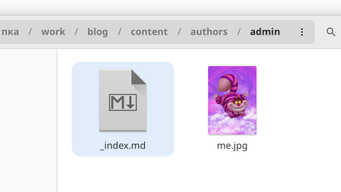
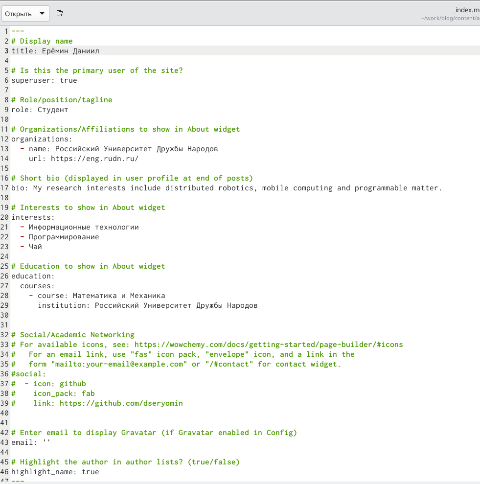
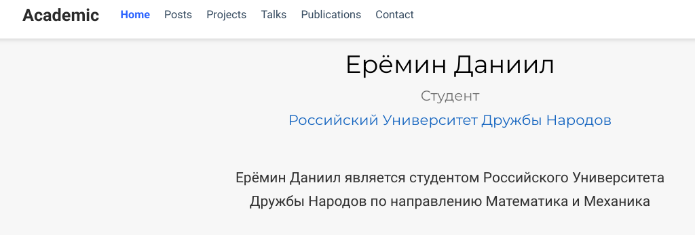
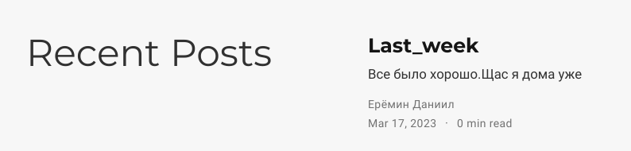
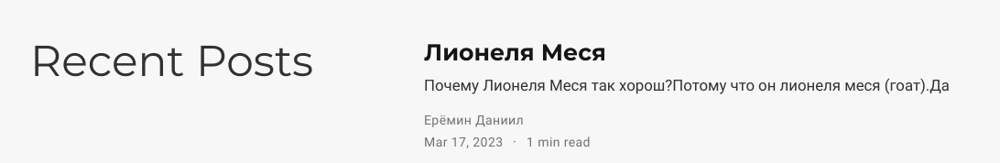

---
## Front matter
lang: ru-RU
title: "Индивидуальный проект"
subtitle: "Этап 2"
author: "Ерёмин Даниил"

## i18n babel
babel-lang: russian
babel-otherlangs: english

## Formatting pdf
toc: false
toc-title: Содержание
slide_level: 2
aspectratio: 169
section-titles: true
theme: metropolis
header-includes:
 - \metroset{progressbar=frametitle,sectionpage=progressbar,numbering=fraction}
 - '\makeatletter'
 - '\beamer@ignorenonframefalse'
 - '\makeatother'
---

## Цели и задачи

Добавить на сайт данные о себе,а также разместить несколько постов

# Создание презентации

## почти моя фотография

{#fig:001 width=90%}

## немного о себе

{#fig:002 width=90%}

## новый сайт

{#fig:003 width=90%}

## last week post

{#fig:004 width=90%}

## лионеля меся пост

{#fig:005 width=90%}

# Результаты

Я добавил на сайт данные о себе и выложил 2 поста.

